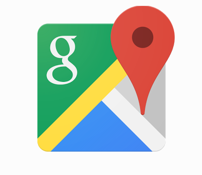

# Tinkle: "If you gotta go, you gotta go"

## About the Project

Tinkle was developed during my time as a Teaching Fellow at the Fullstack Academy of Code alongside Ari Kramer and Shmuel Lotman. Tinkle is an application that will find you the nearest public bathroom. Our current version is limited to New York City but we have plans to expand. Tinkle was built using React Native, Express, Sequelize, and PostgreSQL. We also utilized the NYC Open Data API, Google's Geocode API, and some other fun node modules like 'zipcode'.

## Video Demonstration

## Data Organization

An interesting challenge our group had to overcome was eliminating unnecessary calculations in order to speed up render times. We decided to use the formatted address we received from Google's Geocode API to accomplish this task. For each request we take the user's location, which is in coordinate format, and run it through the Geocode API. This gives us back the user's formatted address; of which we grab the zip code. We then utilize the 'zipcodes' npm module which calculates all of the zip codes within X miles of our user and returns an array of these zip codes. Once we have this array we loop through it, find every bathroom in each zip code, and return an array of bathroom objects. Since we saved each restroom to our database using the formatted address each bathroom object has a zip code, coordinates, and name. This allows us to send all of these objects to the client to be rendered as pins on React Native's MapView component. 

## Google's Geocoding Module

One major hurdle our group had to face was standardizing location data and converting it into a useful format. The City of New York has an Open Data API which allowed us to query for public data on every city owned restroom. Unfortunately, the city's API location data left much to be desired. All the location responses were not standardized addresses, there were no coordinates associated with any of the restrooms, and some responses were extremely vague; such as: "Entrance off the Grand Central Parkway", or "Central Park". Enter the Google Geocode API. We ran each restroom entry from the Open Data API through Google's Geocode API and received a formatted address and coordinates in response, which we saved to our database. We also utilized the Geocoding API to reverse geocode a user's location and in response received a formatted address which we utilized to when querying the database. 